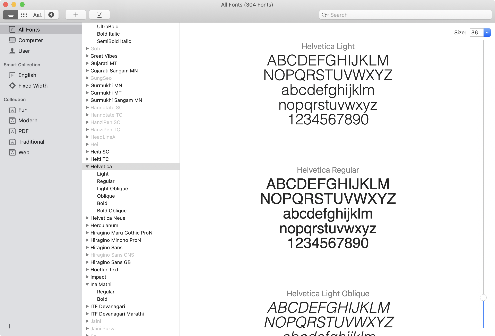
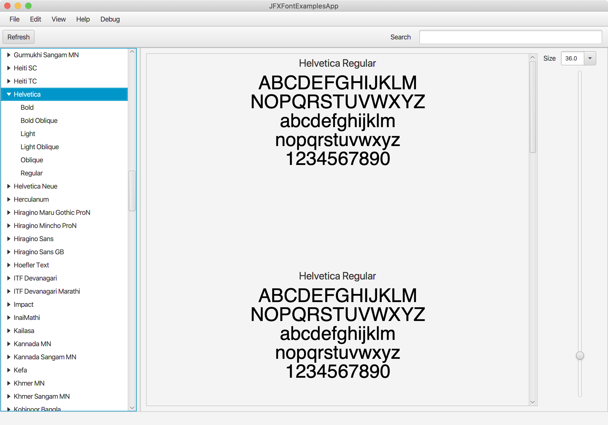
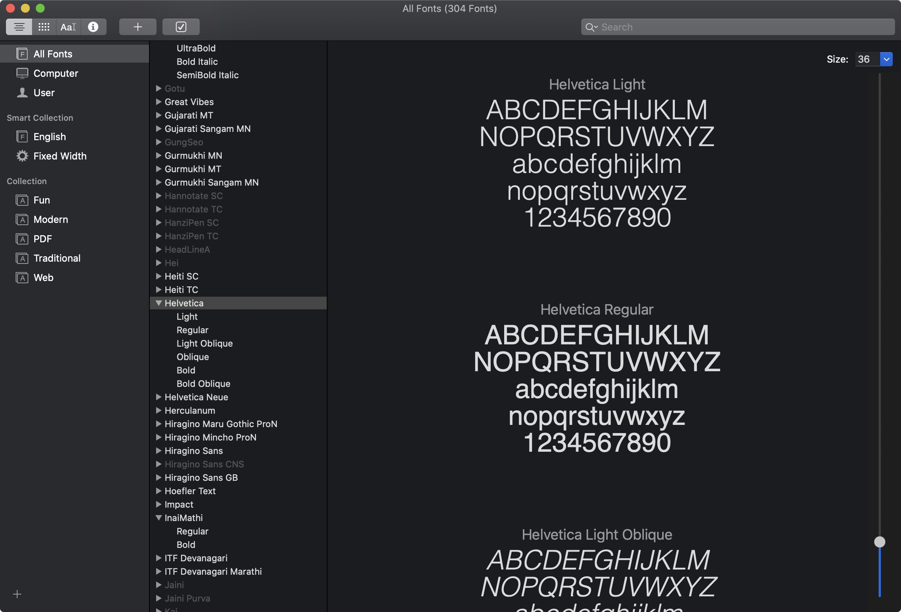
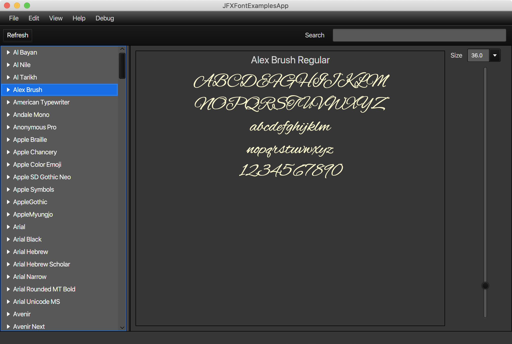

# JFXFontExamples

This project demonstrates how to work with JavaFX fonts. I modeled it on the MacOS application called Font Book.

## Visual Comparison

Here is what Font Book and JFXFontExamples applications look like compared to each other.  This first image is Font Book using the MacOS light theme:

And this is what JFXFontExamples looks like:

And this is Font Book in the native MacOS Dark theme:

Unfortunately I don't have a dark theme for JavaFX, although there must be something out there on the web. I can mess with the JavaFX CSS stuff, but I am not so familiar with CSS.  

I found out how to use the JavaFX CSS stuff to create a themes for my JavaFX apps.  Here is a dark theme that I copied from an article on [StackOverflow](https://stackoverflow.com/questions/49159286/make-a-dark-mode-with-javafx): 

 

The fill color it is using is (how embarassing) lemon chiffon.  I think change it to a nice neutral gray or something.

## Reference Links

* [Make a dark mode with JavaFX](https://stackoverflow.com/questions/49159286/make-a-dark-mode-with-javafx)
* [How to create toolbar with left, center and right sections in javaFX?](https://stackoverflow.com/questions/30832692/how-to-create-toolbar-with-left-center-and-right-sections-in-javafx/30841774)
* [How to hide the controls of HTMLEditor?](https://stackoverflow.com/questions/10075841/how-to-hide-the-controls-of-htmleditor)

